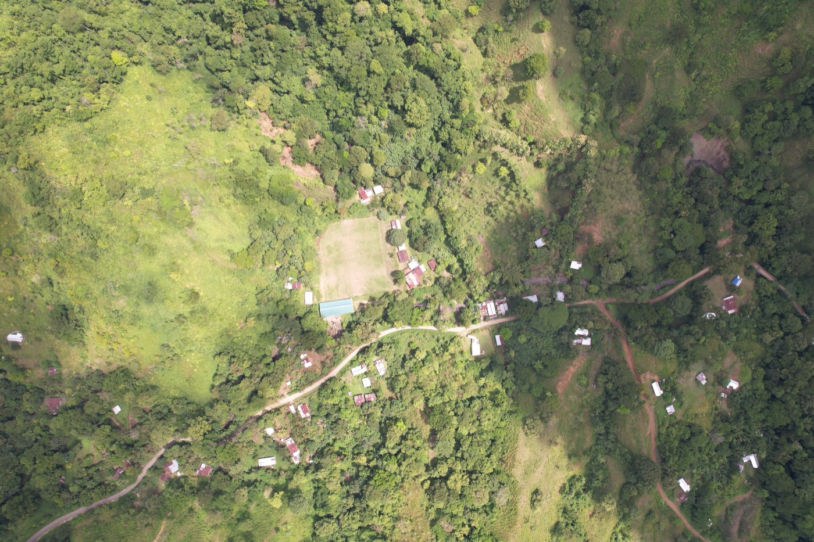
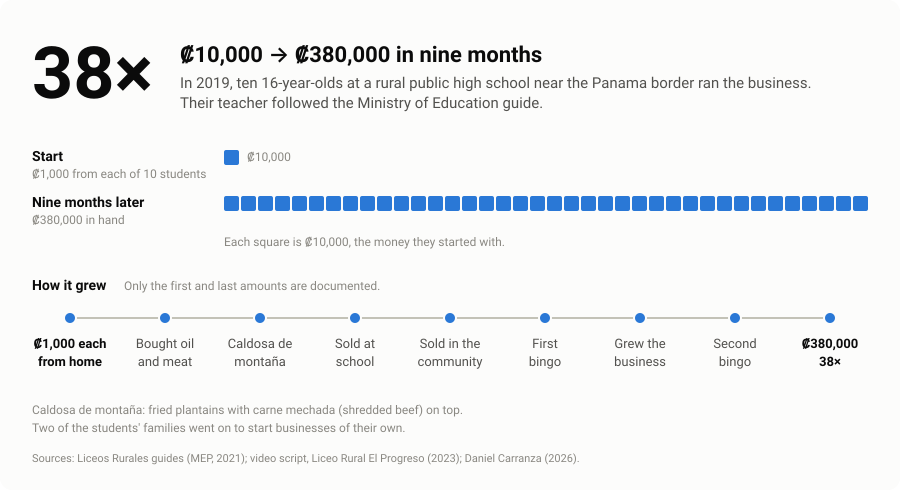

# Case: ₡10,000 to ₡380,000 — the caldosa de montaña

> With very little intervention and some guidance, kids can do anything. This is the case I point to.

*The community around Liceo Rural El Progreso, near the Costa Rica–Panama border, June 2023.*

## The situation

Costa Rica's *liceos rurales* are public high schools in the most remote parts of the country, far from jobs and opportunity. Liceo Rural El Progreso is one of them, near the border with Panama.

Its socio-productive class used the Ministry of Public Education's guides that I worked on (see [teaching-entrepreneurship.md](teaching-entrepreneurship.md)). The guide is written for the teacher, and it is project-based:

- Two lessons a week go to the guide; "las otras lecciones serán dedicadas a la parte práctica del proyecto que el estudiante desarrolle" — the other lessons go to the practical part of the students' own project.
- The project is 65% of the grade. Daily work is 25%, attendance 10%.
- The project runs in phases, with tracking sheets so that students and teacher can see progress.
- Teacher training focuses on five practices: play, creation, experimentation, empathy and reflection.

In 2019 the guides were still in their validation phase in rural schools (the first edition came out in 2021). The students had worked with them for two years. Then ten of them, all 16 years old, decided to run a real project. Their teacher followed the guide.

## What the students did

1. **Seed money.** Each of the ten students brought ₡1,000 (about two dollars) from home, from family or from savings: ₡10,000 in total, about twenty dollars.
2. **Product.** They bought oil and meat, and made a lunch they called **caldosa de montaña**: fried plantains with *carne mechada* (shredded beef) on top.
3. **First market.** They sold it at school.
4. **Second market.** Then they sold it in the community around the school.
5. **Bingo.** They organized a bingo, and the business grew.
6. **Bingo again.** They organized a second bingo, and kept growing.
7. **Result.** Nine months after they started, they had ₡380,000 in hand: 38 times the ₡10,000 they put in.

## Results

| | |
|---|---|
| Who and when | 10 students, all 16 years old, Liceo Rural El Progreso, 2019 |
| Starting money | ₡10,000 (₡1,000 from each of 10 students; about $20) |
| Money at the end | ₡380,000 in hand |
| Multiple | 38× |
| Time | nine months |
| Beyond the money | community activity revived (bingos, raffles); two of the students' families started businesses of their own |

## Why it worked: the five practices in one project

The guide trains teachers in Babson College's five practices (Neck, Greene and Brush, 2014). This is how I read the project through them.

| Practice | In this project |
|---|---|
| **Creation** — "produce something of value with what they have" | ₡10,000, oil, meat and plantains became a product people paid for. |
| **Experimentation** — "trying something, seeing what the results are, learning from the results, and then trying it again" | School first, then the community: a market test that grew one step at a time. The book has an exercise with this shape, *Escalating market tests*. |
| **Empathy** — understanding "the needs of others" | They sold a lunch to people they knew — classmates, then neighbors — so every sale was also feedback. |
| **Play** | The bingos turned a community game into sales and money for the business. |
| **Reflection** | The guide asks for it at every phase. The documentation of this case does not show how the students did it; it is the first thing I would ask them. |

And through EntreComp (Joint Research Centre, 2016), the competences the project shows: 2.3 Mobilizing resources ("Make the most of limited resources"), 3.1 Taking the initiative, 2.4 Financial and economic literacy, 3.4 Working with others, 2.5 Mobilizing others (the bingos).

## What the teacher did

The teacher did not run the business. The teacher followed a guide that gave the class a structure: time for the project, phases, tracking sheets, a grade that rewarded doing. The students supplied the rest: the money, the product, the customers, the bingos.

That is the design principle behind this repo. **Structure and guidance, not instruction.** The guide was the structure for a class. The vault is the structure for one student, and the agent gives the guidance: it asks, it files facts, it designs the cheapest test. It never runs the business and never writes the student's thinking.

## What it means for an expertise app

1. **Structure beats content.** The guide did not teach the students what to sell. It gave them a way to work. The five practice folders and the dashboard do the same.
2. **Small real stakes make it theirs.** ₡1,000 each was enough. In the vault, a hypothesis with a date to check it is the same idea at the size of a thought.
3. **Start where you are, then widen.** School, then community. Experiments in the vault start as small as possible.
4. **The community is part of the classroom.** The bingos, and two families who started businesses. Expertise has to leave the app: creations link the positions they express.

## Sources

| Fact | Source |
|---|---|
| Ten students gathered ₡10,000 and, following the guides, started their business; sales at school and bingos in the community; "multiplicaron su inversión 38 veces"; ₡380,000; two families started businesses; community activity revived | Video script, Liceo Rural El Progreso, 2023 |
| The students had studied the guides for two years; "en menos de un año hicieron 380 mil colones" | Same script |
| 2019; the students were 16; ₡380,000 was the money they had at the end, after nine months; ₡1,000 per student from home, family or savings; oil and meat; caldosa de montaña; school, then community; first bingo, growth, second bingo; the teacher followed the guide's project lessons | Daniel Carranza, 2026 |
| Two lessons a week on the guide, the rest on the project; project 65% of the grade; tracking sheets; the five practices in teacher training; phase 1 of the guides' validation ended in late 2019 | Ministerio de Educación Pública (2021), *Guía didáctica para el área socio productiva de los liceos rurales*, 7.º año, pp. 4, 8–9 |
| Definitions of the five practices | Neck, Greene and Brush (2014), *Teaching Entrepreneurship: A Practice-Based Approach*, pp. 16–17; Volume Two (2021), p. 7 |
